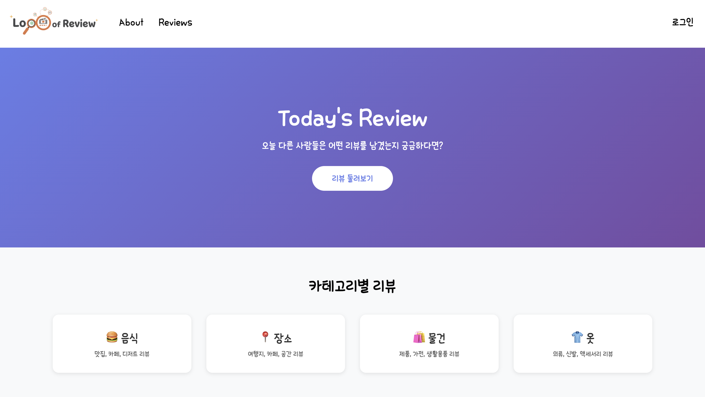
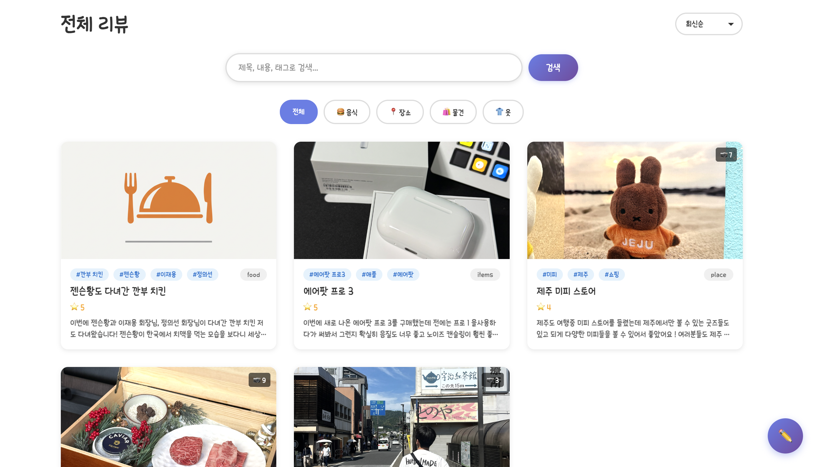
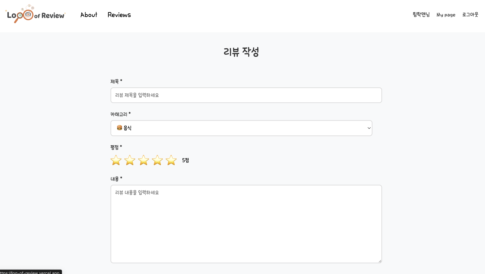

# LogOfReview

리뷰 작성/조회 중심 블로그 서비스로, CRUD와 인증/권한, 검색/필터/정렬 흐름을 구현한 프로젝트입니다.

## 1. 프로젝트 개요

- 목적: 실무에서 자주 사용하는 리뷰/댓글 도메인을 기준으로 CRUD와 상태 관리를 학습
- 핵심 포인트: React Query 기반 서버 상태 관리, Zustand 인증 상태 관리, REST API 구조화
- 개발 형태: 개인 프로젝트

## 2. 링크

- 배포: https://log-of-review.vercel.app
- 저장소: https://github.com/guiyoung2/LogOfReview

## 3. 주요 기능

- 리뷰 CRUD (작성, 조회, 수정, 삭제)
- 댓글 CRUD 및 작성자 권한 체크
- 제목/내용/태그 검색 + 카테고리/정렬 필터
- 로그인 상태 기반 UI 분기
- 반응형 UI, 이미지 모달, Toast 알림

## 4. 기술 스택

- Frontend: React 19, TypeScript, Vite, React Router
- Styling: Styled Components
- State: TanStack Query 5, Zustand 5
- API: Axios, JSON Server (개발 환경)
- Tooling: ESLint

## 5. 기술 선택과 구현 포인트

### React Query 중심 데이터 흐름

- 리뷰/댓글 조회와 변경을 `useQuery`, `useMutation`으로 일관되게 관리했습니다.
- `invalidateQueries`로 쓰기 작업 이후 목록 동기화 시점을 명확히 했습니다.
- queryKey에 검색/카테고리/정렬 조건을 포함해 재요청 기준을 예측 가능하게 설계했습니다.

### Zustand + Axios 인터셉터 인증 처리

- 사용자 상태를 Zustand로 관리하고, 토큰 주입을 Axios 인터셉터로 통합했습니다.
- 인증 관련 분기(로그인/권한 체크)를 컴포넌트 전역에서 일관되게 유지했습니다.

### 환경별 데이터 전략 분리

- 개발 환경에서는 JSON Server, 배포 환경에서는 정적 데이터 전략을 적용했습니다.
- 데모 환경에서 쓰기 동작을 제한해 테스트 데이터 누적 문제를 방지했습니다.

## 6. API 및 라우팅

### 주요 라우트

- `/` 홈
- `/reviews` 리뷰 목록
- `/reviews/new` 리뷰 작성
- `/reviews/:id` 리뷰 상세
- `/reviews/:id/edit` 리뷰 수정
- `/login` 로그인

### 주요 API

- `GET /reviews`, `GET /reviews/:id`, `POST /reviews`, `PUT /reviews/:id`, `DELETE /reviews/:id`
- `GET /comments?reviewId=:id`, `POST /comments`, `PUT /comments/:id`, `DELETE /comments/:id`
- `POST /login`

## 7. 프로젝트 구조

```text
src/
├── api/         # axios 인스턴스, reviews/comments/users/login API
├── components/  # common, review, comment 컴포넌트
├── pages/       # Home/About/Reviews/Detail/Write/Edit/Login/NotFound
├── store/       # userStore (Zustand)
├── types/       # review/comment/user 타입
├── App.tsx
└── main.tsx
```

## 8. 실행 방법

```bash
npm install
npm run dev
npm run server
```

- Frontend: `http://localhost:5173`
- API Server: `http://localhost:3001`

## 9. 스크린샷

### 메인/리뷰 목록 화면



- 카테고리, 검색, 정렬을 조합해 리뷰 목록을 탐색할 수 있습니다.

### 리뷰 상세 + 댓글 화면



- 리뷰 본문, 작성자 정보, 댓글 목록/작성 흐름을 하나의 화면에서 확인할 수 있습니다.

### 리뷰 작성/수정 화면



- 작성/수정 폼을 공통화해 입력 흐름과 검증 로직을 일관되게 유지했습니다.

## 10. 트러블슈팅

### 1) 조건 변경 시 목록 갱신 기준이 꼬이는 문제

- 문제: 검색어/카테고리/정렬 조건이 바뀌어도 이전 결과가 잠시 보이거나, 의도하지 않은 캐시가 재사용되는 경우가 있었습니다.
- 원인: 쿼리 키에 조건 값이 충분히 반영되지 않아 캐시 구분이 모호했습니다.
- 해결: queryKey에 카테고리, 검색어, 정렬 옵션을 모두 포함해 조회 조건별 캐시를 명확히 분리했습니다.
- 결과: 조건 변경 시 항상 의도한 데이터가 조회되어 목록 일관성이 개선되었습니다.

### 2) 인증 만료 후 요청 실패가 반복되는 문제

- 문제: 토큰이 만료된 상태에서 API 요청이 반복 실패하며 사용자 경험이 저하되었습니다.
- 원인: 인증 실패 처리 로직이 각 요청부에 흩어져 있어 401 예외를 공통 처리하지 못했습니다.
- 해결: Axios 응답 인터셉터에서 401을 감지하면 `logout()`을 호출하도록 공통 처리로 통합했습니다.
- 결과: 만료 토큰 상태에서 빠르게 로그인 상태가 정리되고, 실패 반복 호출이 줄어들었습니다.
