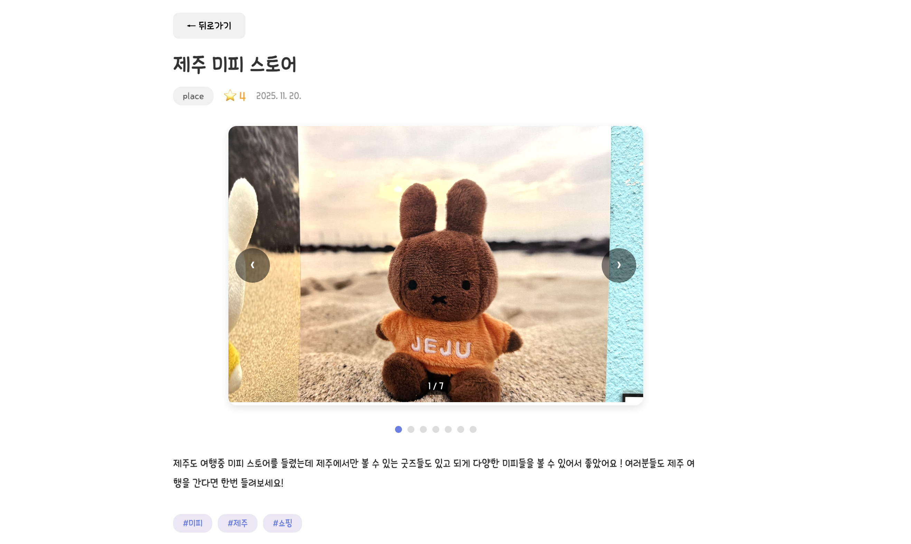
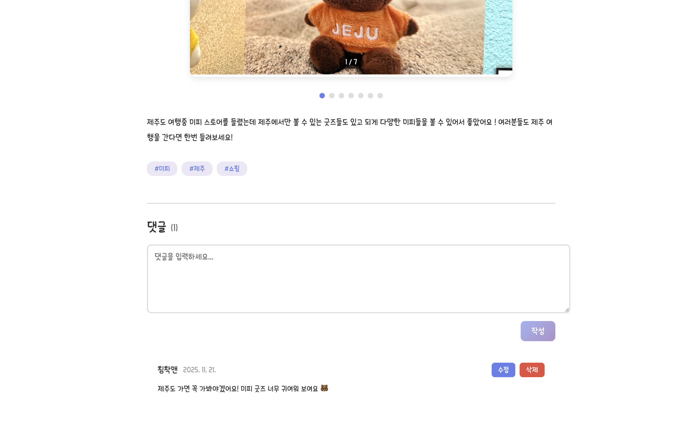

# LogOfReview

> 리뷰 콘텐츠를 작성·검색·평가할 수 있는 블로그형 웹 서비스.
> 정적 데이터 기반 SPA에서 **클라이언트 아키텍처(URL 상태 관리·API 레이어 분리·캐시 정책)**를 직접 설계하고 검증한 프로젝트.
> dev는 JSON Server로 RESTful API를 모킹하고, prod는 정적 JSON을 클라이언트에서 필터링하는 구조.


[](https://react.dev/)
[](https://www.typescriptlang.org/)
[](https://vitejs.dev/)
[](https://tanstack.com/query)
[](https://zustand-demo.pmnd.rs/)
[](https://axios-http.com/)
[](https://styled-components.com/)

**Live**: [log-of-review.vercel.app](https://log-of-review.vercel.app)
**Repo**: [github.com/guiyoung2/LogOfReview](https://github.com/guiyoung2/LogOfReview)

---

## 1. Highlights

| 영역                | 내용                                                                                                |
| ------------------- | --------------------------------------------------------------------------------------------------- |
| **URL 기반 상태**   | 검색어·카테고리·정렬을 모두 쿼리스트링으로 관리 — 새로고침·뒤로가기·URL 공유에 상태 보존           |
| **API 레이어 분리** | dev(json-server)·prod(정적 JSON) 분기를 `dataSource.ts` 단일 파일에 집중, 컴포넌트는 환경을 모름   |
| **캐시 정책 명시**  | TanStack Query staleTime 5분·gcTime 10분·refetchOnWindowFocus off — mutation 후 invalidateQueries로 갱신 |
| **클라이언트 상태** | Zustand persist로 인증 상태 영속화, Axios 인터셉터로 토큰 자동 주입                                |
| **권한 모델**       | ProtectedRoute로 라우터 레벨 접근 제어, 본인 작성 리뷰·댓글만 수정/삭제 가능                      |

---

## 2. 기술 스택과 선택 이유

| 구분                | 기술                | 선택 이유                                                                                                                                   |
| ------------------- | ------------------- | ------------------------------------------------------------------------------------------------------------------------------------------- |
| **빌드**            | Vite 7              | HMR 빠르고 ESM 기반, 가벼운 SPA에 가장 적합                                                                                                |
| **언어**            | TypeScript          | 리뷰·댓글·유저 도메인 모델을 타입으로 명세                                                                                                 |
| **UI**              | React 19            | Concurrent 모드 등 최신 패턴                                                                                                                |
| **스타일**          | Styled Components 6 | 컴포넌트 단위 스타일 캡슐화, prop 기반 동적 스타일 학습 목적                                                                               |
| **라우팅**          | React Router 7      | SPA 라우팅 표준, `useSearchParams`로 URL 상태 직렬화                                                                                       |
| **데이터 패칭**     | TanStack Query 5    | dev에서 queryKey 기반 캐시·무효화·mutation. staleTime 5분·gcTime 10분 명시적 설정. SWR은 mutation/invalidation API가 빈약해 제외           |
| **클라이언트 상태** | Zustand 5           | persist 미들웨어로 인증 상태 영속화. Redux 대비 보일러플레이트 적음                                                                        |
| **HTTP**            | Axios 1             | 인터셉터로 토큰 주입·에러 핸들링을 횡단적으로 처리. fetch 커스텀 래퍼 대비 인터셉터 체인 관리가 명확                                       |
| **Mock API**        | JSON Server         | 백엔드 의존 없이 클라이언트 아키텍처에 집중하기 위해 선택. prod에서는 정적 JSON으로 대체                                                   |

---

## 3. 측정 결과

| 항목 | 값 |
| ---- | --- |
| **테스트 케이스** | 22개 (4개 파일) |
| **커버리지 — Statements** | 60.31% |
| **커버리지 — Branches** | 51.81% |
| **커버리지 — Functions** | 44.73% |
| **커버리지 — Lines** | 60.90% |
| **JS 번들 (gzip)** | 124.02 kB |
| **CI** | GitHub Actions — push·PR 시 lint·타입체크·테스트·빌드 자동 실행 |
| **Lighthouse Performance** | 홈 **86** / 목록 **60** / 상세 **60** (Chrome Mobile, 배포 기준) |

커버리지 대상: `api/reviews.ts`, `pages/ReviewsPage.tsx`, `components/review/ReviewCard.tsx`, `api/axios.ts`, `store/userStore.ts` 등 핵심 도메인.
Lighthouse 목록·상세 60점 병목은 json-server mock API 직렬 호출 구조에 기인 — prod 정적 JSON 구조에서는 LCP 개선 가능.

---

## 4. 주요 기능

### 리뷰 CRUD

- 작성·조회·수정·삭제
- 본인 글만 수정/삭제 (UI 노출 + API 호출 단 이중 체크)
- 다중 이미지 슬라이더
- 태그 입력

### 검색·필터링

- 제목·내용·태그 검색
- 카테고리 필터 (음식 / 장소 / 물건 / 옷)
- 정렬 (최신순 / 오래된순 / 평점 높은순 / 평점 낮은순)
- **검색어·카테고리·정렬 모두 URL 쿼리스트링으로 직렬화**

### 댓글 시스템

- 작성·수정·삭제 + 본인 글만 권한 부여
- 작성자 닉네임 표시 (`userId` → `nickname` 매핑)
- 수정 모드 토글 (같은 폼 컴포넌트 재사용)

### 인증

- 로그인/로그아웃
- 토큰 localStorage 영속 (Zustand persist)
- Axios 요청 인터셉터에서 토큰 자동 주입

### UI/UX

- 반응형 레이아웃
- 모바일 햄버거 메뉴
- 이미지 확대 모달
- Toast 알림

---

## 5. 트러블슈팅 / 의사결정

### 5-1. queryKey 설계로 자동 재요청 처리

**문제**
검색어·카테고리·정렬을 별도 상태로 관리하면, 조합이 바뀔 때마다 명시적으로 `refetch()`나 `invalidateQueries()`를 호출해야 합니다. 호출을 빠뜨리면 화면과 데이터가 어긋납니다.

**해결**
queryKey에 필터/정렬 값을 그대로 포함시킵니다.

```ts
useQuery({
  queryKey: ["reviews", category, activeSearchQuery, sortBy],
  queryFn: () => fetchReviews({ category, sortBy, q: activeSearchQuery }),
});
```

queryKey가 바뀌면 TanStack Query가 **새로운 쿼리로 인식**해 자동으로 재요청합니다. 별도 명령 없이 URL·UI·데이터가 항상 일관되게 동기화됩니다.

**결과**
호출 누락에서 오는 버그 가능성을 구조적으로 제거. queryKey 설계만 잘하면 상태 동기화는 라이브러리에 위임.

### 5-2. URL 쿼리스트링 기반 상태 관리

**문제**
검색·필터·정렬 상태를 컴포넌트 state로만 들고 있으면 새로고침·뒤로가기·링크 공유에서 상태가 사라집니다.

**해결**
React Router의 `useSearchParams`로 검색어(`q`)·카테고리(`category`)·정렬(`sort`)을 모두 URL 쿼리스트링에 직렬화. queryKey도 URL 파생값에서 가져오도록 구성.

```ts
const category = searchParams.get("category") || undefined;
const activeSearchQuery = searchParams.get("q") || "";
const sortBy = parseSortOption(searchParams.get("sort"));
```

검색 입력창은 로컬 state(`searchQuery`)로 타이핑 중 상태를 유지하고, 검색 확정(Enter·버튼) 시에만 URL을 갱신합니다.

**결과**
사용자가 새로고침해도 같은 화면이 뜨고, URL을 그대로 공유하면 동일한 필터 상태가 재현됩니다. 뒤로가기 시 직전 필터 복원.

### 5-3. dev/prod 데이터 소스 단일 추상화

**문제**
환경 분기(`import.meta.env.PROD`)가 `reviews.ts`·`comments.ts` 등 여러 파일에 흩어져 있어, CLAUDE.md 규칙("컴포넌트·API 함수에서 직접 환경 분기 금지")과 불일치했습니다.

**해결**
`src/api/dataSource.ts`에 `loadReviews()`·`loadComments()`·`assertWritable()`을 집중. 각 API 함수는 이 레이어만 호출합니다.

```ts
// 환경 분기를 한 곳에서만 처리
export const loadReviews = async (): Promise<Review[]> => {
  if (import.meta.env.PROD) {
    return fetch("/reviews.json").then((r) => r.json());
  }
  return api.get<Review[]>("/reviews").then((r) => r.data);
};
```

**결과**
환경 분기가 한 파일에 집중됩니다. prod 동작 변경이 필요할 때 수정 위치가 명확합니다.

### 5-4. ProtectedRoute로 접근 제어 일원화

**문제**
로그인이 필요한 페이지(리뷰 작성·수정)의 인증 체크가 각 컴포넌트 내부에 분산돼 있어, 페이지가 늘어날수록 누락 가능성이 높습니다.

**해결**
`ProtectedRoute` 컴포넌트를 라우터 레벨에 배치해 비로그인 시 `/login`으로 자동 리다이렉트. 보호가 필요한 경로를 `<ProtectedRoute>`로 감싸는 것만으로 접근 제어가 적용됩니다.

```tsx
<Route path="/reviews/new" element={<ProtectedRoute><ReviewWritePage /></ProtectedRoute>} />
<Route path="/reviews/:id/edit" element={<ProtectedRoute><EditReviewPage /></ProtectedRoute>} />
```

**결과**
인증 로직이 라우터 레벨에서 단일 책임으로 처리. 새 보호 경로 추가 시 컴포넌트 수정 불필요.

### 5-5. Axios 인터셉터 + Zustand persist로 토큰 일원화

**문제**
인증 토큰을 매 API 함수마다 헤더로 붙이면 보일러플레이트가 누적되고, 로그아웃 시 누락된 곳이 생기면 보안 이슈로 연결됩니다.

**해결**

- **저장**: Zustand `persist` 미들웨어로 토큰을 localStorage에 영속
- **주입**: Axios 요청 인터셉터에서 store의 토큰을 자동으로 헤더에 추가
- **만료**: 응답 인터셉터에서 `401` 감지 시 store 초기화

**결과**
각 API 함수는 비즈니스 로직에만 집중. 토큰 관리는 횡단 관심사로 분리.

### 5-6. 같은 폼 컴포넌트로 작성·수정 모드 처리

**문제**
"댓글 작성"과 "댓글 수정"을 별도 컴포넌트로 만들면 동일한 입력·검증 로직이 중복됩니다.

**해결**
`CommentForm`에 `mode: 'create' | 'edit'` prop과 `initialValue` prop을 받아 한 컴포넌트로 두 시나리오를 처리. 제출 시점에 mode에 따라 `POST` 또는 `PUT` mutation을 호출.

**결과**
폼 검증·UX가 두 시나리오에서 자동 일치. 변경 시 한 곳만 손보면 됨.

---

## 6. 프로젝트 구조

```
src/
├── api/                       # API 함수와 Axios 인스턴스
│   ├── axios.ts               # 인터셉터 (토큰 주입 / 401 처리)
│   ├── dataSource.ts          # dev/prod 데이터 소스 분기
│   ├── reviews.ts
│   ├── comments.ts
│   ├── users.ts
│   └── login.ts
├── components/
│   ├── common/                # Header, Toast, ProtectedRoute
│   ├── review/                # ReviewCard, ReviewForm
│   └── comment/               # CommentList, CommentItem, CommentForm
├── pages/
│   ├── HomePage.tsx
│   ├── AboutPage.tsx
│   ├── ReviewsPage.tsx        # 목록 + 검색·필터·정렬 (모두 URL 상태)
│   ├── ReviewDetailPage.tsx
│   ├── ReviewWritePage.tsx
│   ├── EditReviewPage.tsx
│   ├── LoginPage.tsx
│   └── NotFoundPage.tsx
├── store/
│   └── userStore.ts           # Zustand persist
├── types/
│   ├── review.ts
│   ├── comment.ts
│   └── user.ts
├── App.tsx
└── main.tsx
```

### 라우팅

```
/                          → HomePage
/about                     → AboutPage
/reviews                   → ReviewsPage         (목록 + 검색·필터)
/reviews/new               → ReviewWritePage     (ProtectedRoute)
/reviews/:id               → ReviewDetailPage
/reviews/:id/edit          → EditReviewPage      (ProtectedRoute)
/login                     → LoginPage
*                          → NotFoundPage (404)
```

### API 엔드포인트 (JSON Server / dev)

```
GET    /reviews?category=&sort=&q=
GET    /reviews/:id
POST   /reviews
PUT    /reviews/:id
DELETE /reviews/:id

GET    /comments?reviewId=
POST   /comments
PUT    /comments/:id
DELETE /comments/:id

GET    /users
POST   /login
```

> prod에서는 `/reviews.json`·`/comments.json` 정적 파일을 fetch해 클라이언트에서 필터·정렬합니다.

---

## 7. 실행 방법

### 설치

```bash
npm install
```

### 개발 서버 (프론트 + Mock API)

터미널 1 — 프론트엔드

```bash
npm run dev
```

터미널 2 — Mock API (JSON Server)

```bash
npm run server
```

- 프론트엔드: `http://localhost:5173`
- API: `http://localhost:3001`

### 빌드

```bash
npm run build
```

빌드 시 `db.json`이 `dist`로 자동 복사됩니다.

---

## 8. 스크린샷

### 메인/리뷰 목록


- 카테고리, 검색, 정렬을 조합해 리뷰 목록을 탐색할 수 있습니다.

### 리뷰 상세 + 댓글





- 리뷰 본문, 작성자 정보, 댓글 목록/작성 흐름을 하나의 화면에서 확인할 수 있습니다.

### 리뷰 작성/수정


- 작성/수정 폼을 공통화해 입력 흐름과 검증 로직을 일관되게 유지했습니다.

---

## 9. 회고

- **queryKey 설계가 곧 동기화 설계** — refetch를 명시적으로 호출하지 않고 queryKey만 잘 만들어도 화면·데이터·URL이 일관되게 유지된다는 것을 체감했습니다.
- **상태의 위치를 정하는 게 절반** — 필터·정렬 같은 "공유 가능해야 하는 상태"는 컴포넌트 state가 아니라 URL이 자연스러운 자리였습니다.
- **인터셉터로 횡단 관심사 분리** — 토큰 주입·만료 처리를 각 API 함수가 모르도록 분리해, 비즈니스 로직과 인증을 분리하는 감각을 익혔습니다.
- **Mock API로 클라이언트 아키텍처에 집중** — 백엔드를 직접 만드는 부담 없이 서버 상태·캐시·동기화 패턴 학습에 시간을 쓸 수 있었습니다. 다음 프로젝트에서는 Supabase로 실제 DB·인증과 결합해 같은 패턴을 확장했습니다.
